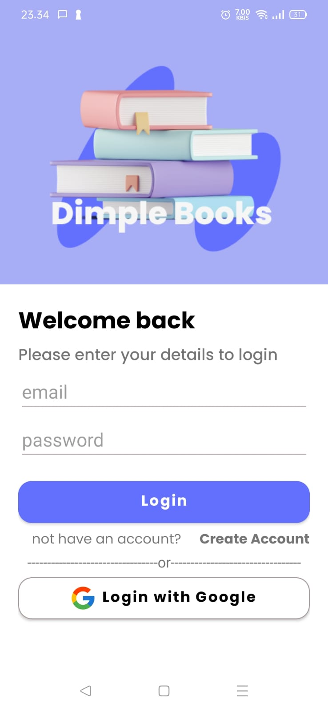
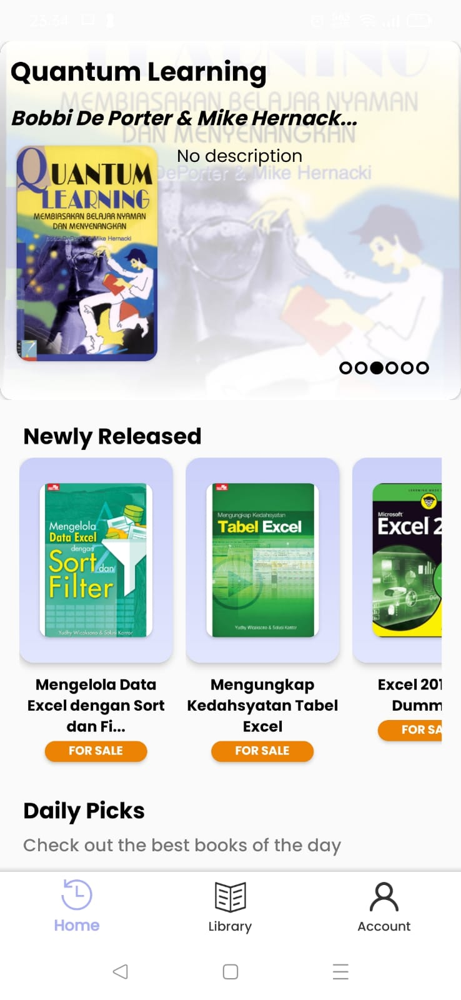
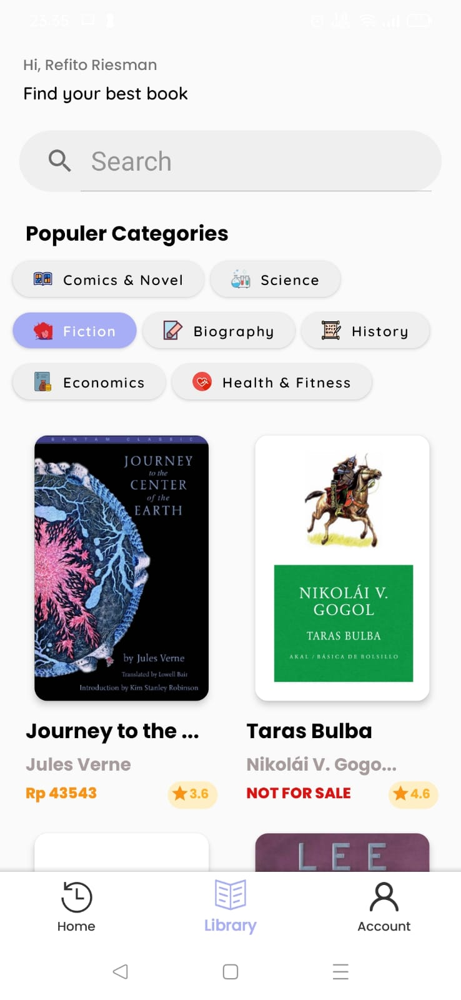
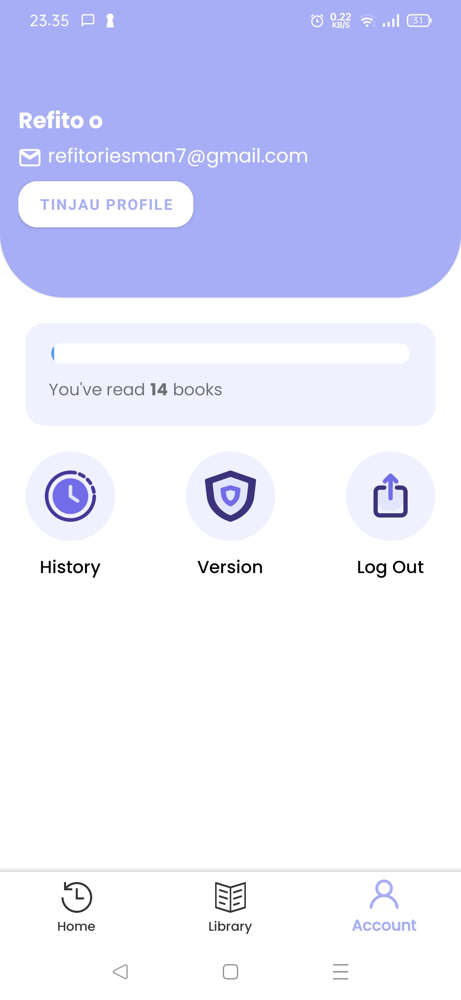

# Dimple Books - Aplikasi E-book 📚

Dimple Books adalah aplikasi e-book yang memungkinkan pengguna untuk mencari, melihat detail, dan melacak riwayat buku yang telah dibaca. Aplikasi ini mengintegrasikan Google Books API untuk data buku, Firebase untuk otentikasi (Google Sign-In dan email/password), serta Room Database untuk penyimpanan riwayat buku secara lokal.

## Fitur Utama ✨

* **Pencarian Buku** 🔍: Cari buku berdasarkan judul, penulis, atau kategori menggunakan Google Books API.
* **Detail Buku** 📖: Lihat informasi lengkap tentang buku, termasuk deskripsi, jumlah halaman, bahasa, kategori, dan rating. Terdapat juga tautan langsung untuk pembelian buku di Google Play Books.
* **Otentikasi Pengguna** 🔐:
    * **Google Sign-In** 📧: Masuk dengan mudah menggunakan akun Google Anda.
    * **Email/Password** 🔑: Daftar dan masuk menggunakan email dan password.
* **Riwayat Bacaan Lokal** 📚: Simpan riwayat buku yang telah Anda baca secara lokal menggunakan Room Database.

## Tampilan halaman Aplikasi 🌐

| Halaman Login                                   | Halaman Utama                                   | Halaman Pencarian                                 | Halaman Detail Buku                               | Halaman Pengaturan Akun                 |
| :-------------------------------------------- | :-------------------------------------------- | :---------------------------------------------- | :---------------------------------------------- | :---------------------------------------------- |
|  |  |  |  |  |

## Teknologi yang Digunakan 🛠️

* **Kotlin** 💻: Bahasa pemrograman utama untuk pengembangan Android.
* **Google Books API** 🌐: Untuk mendapatkan data buku.
* **Firebase Authentication** 🔥: Untuk sistem otentikasi pengguna (Google Sign-In dan email/password).
* **Room Database** 🗄️: Untuk penyimpanan data riwayat buku secara lokal.
* **Retrofit** 🔄: Untuk melakukan panggilan API ke Google Books.
* **Glide** 🖼️: Untuk memuat gambar sampul buku.
* **Material Design** 🎨: Untuk komponen UI yang modern dan responsif.
